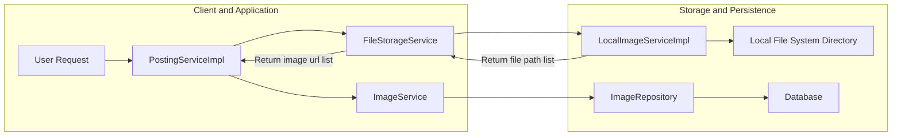

```mermaid
flowchart LR
    %% 클라이언트 및 어플리케이션 계층
    subgraph Client and Application
        C[User Request]
        PS[PostingServiceImpl]
        FS[FileStorageService]
        IS[ImageService]
    end

    %% 스토리지 및 데이터 영속 계층
    subgraph Storage and Persistence
        LIS[LocalImageServiceImpl]
        FSYS[Local File System Directory]
        IR[ImageRepository]
        DB[Database]
    end

    %% 흐름 연결
    C --> PS
    PS --> FS
    FS --> LIS
    LIS --> FSYS
    LIS -- Return file path list --> FS
    FS -- Return image url list --> PS
    PS --> IS
    IS --> IR
    IR --> DB
```