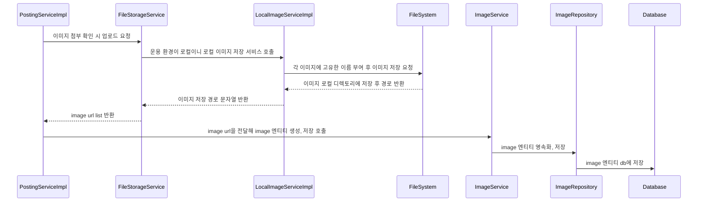

```mermaid
sequenceDiagram
    participant PS as PostingServiceImpl
    participant FS as FileStorageService
    participant LIS as LocalImageServiceImpl
    participant FSYS as FileSystem
    participant IS as ImageService
    participant IR as ImageRepository
    participant DB as Database

    PS->>FS:  이미지 첨부 확인 시 업로드 요청
    FS->>LIS: 운용 환경이 로컬이니 로컬 이미지 저장 서비스 호출
    LIS->>FSYS: 각 이미지에 고유한 이름 부여 후 이미지 저장 요청
    FSYS-->>LIS: 이미지 로컬 디렉토리에 저장 후 경로 반환
    LIS-->>FS: 이미지 저장 경로 문자열 반환
    FS-->>PS: image url list 반환
    PS->>IS: image url을 전달해 image 엔티티 생성, 저장 호출
    IS->>IR: image 엔티티 영속화, 저장
    IR->>DB: image 엔티티 db에 저장
```